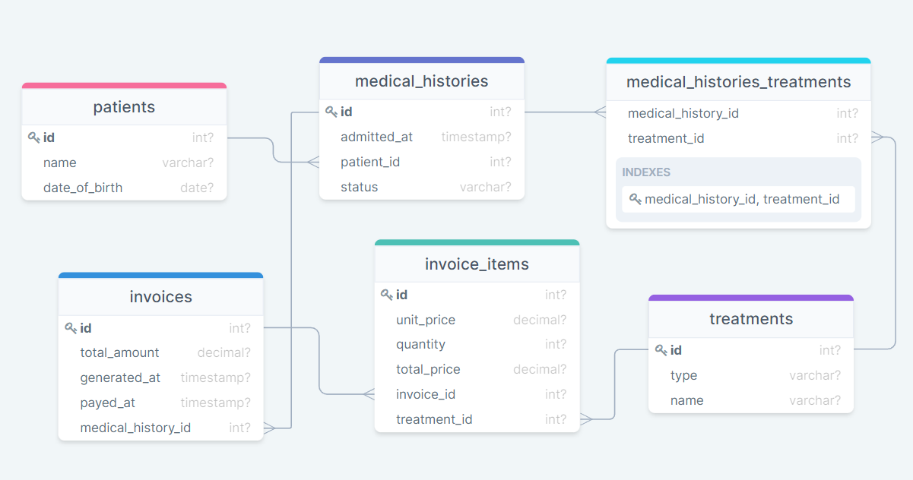

# Hospital Database Based on Diagram

> This Database is based on diagram project

## Getting Started

This repository includes files with plain SQL that can be used to recreate a database:

- [schema.sql](./schema.sql) to create all tables.
- [data.sql](./data.sql) to populate tables with sample data.
- [queries.sql](./queries.sql) for examples of queries that can be run on a newly created database.

## Authors

👤 **PASCAL KABIKA MP.**

- GitHub: [Paskab012](https://github.com/Paskab012?tab=overview&from=2021-12-01&to=2021-12-31)
- LinkedIn: [LinkedIn](https://www.linkedin.com/in/pascal-kabika-443061220/)

👤 **Vignesh**

- GitHub: [@vikipretium](https://github.com/vikipretium)
- Twitter: [@vikipretium](https://twitter.com/vikipretium)
- LinkedIn: [vikipretium](https://linkedin.com/in/vikipretium)

## 🤝 Contributing

Contributions, issues, and feature requests are welcome!

Feel free to check the [issues page](../../issues/).

## Show your support

Give a ⭐️ if you like this project!

## Acknowledgments

- Hat tip to anyone whose code was used
- Inspiration
- etc

## 📝 License

This project is [MIT](./MIT.md) licensed.
